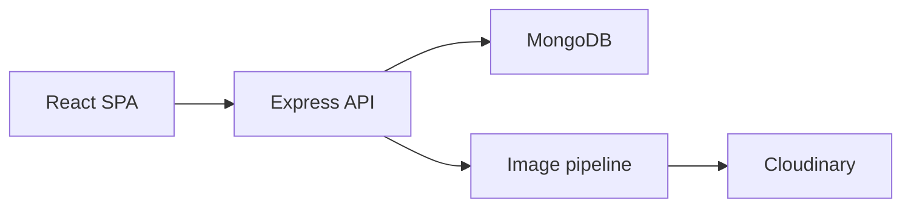

# Fancy Enterprise


Fancy Enterprise is a full-stack e-commerce application built with React (Vite), Redux Toolkit, Express and MongoDB.

---

Core features

- Product catalog and search (`GET /api/products`)
- Product CRUD (admin-protected)
- User accounts and JWT authentication
- Cart and checkout workflow (Checkout → Order)
- Image upload and processing pipeline (multer → sharp; optional Cloudinary upload)
- Seed scripts for development data
- Tests: Jest + Supertest (backend), Vitest (frontend)


Architecture




Implementation notes

- Frontend: React 19, Vite, Redux Toolkit, React Router v7, Tailwind CSS. Entry: `frontend/src/main.jsx` → `frontend/src/App.jsx`.
- Backend: Node.js, Express 5, Mongoose. Routes organized under `backend/routes/` and middleware under `backend/middleware/`.
- Auth: JWT tokens validated in `backend/middleware/authMiddleware.js`. Passwords hashed with bcrypt.
- Security: helmet, input sanitization, express-rate-limit, CORS and morgan logging are used in server bootstrap.
- Image pipeline: Cloudinary stream upload implemented in upload routes (requires CLOUDINARY_* env vars); local processing uses sharp via `config/upload`.
- Seeders: `backend/seeder.js` and related files populate sample data for development.


Quick start

1. Clone

```bash
git clone git@github.com:bardan8586/Fancy-Enterprise.git
cd Fancy-Enterprise
```

2. Backend

```bash
cd backend
cp env.example .env
# set MONGODB_URI and JWT_SECRET and any provider keys if used
npm install
npm run seed   # optional: populate sample data
npm start
```

3. Frontend

```bash
cd frontend
cp env.example .env
npm install
npm run dev
# open http://localhost:5173
```


Environment variables

See `backend/env.example` and `frontend/env.example`. Examples in the repository include (development):

- MONGODB_URI
- JWT_SECRET
- PORT
- CLOUDINARY_CLOUD_NAME, CLOUDINARY_API_KEY, CLOUDINARY_API_SECRET (optional)
- SENDGRID_API_KEY / MAILGUN_API_KEY (optional)


Limitations and notes

- Payment provider integrations (Stripe/PayPal/etc.) are not implemented server-side. The backend records payment method and status but provider-specific server SDK/webhook handling must be added for live payments.
- Production hardening is required before public deployment: secret management, webhook signature verification, tighter CSP/HSTS, and monitoring.
- The repository contains a project logo under `frontend/public/` but no curated UI screenshots. Add screenshots to `docs/screenshots/` if desired.


Project layout (high level)

```
frontend/   # React app (Vite)
backend/    # Express API, routes/, models/, middleware/
docs/       # deployment & design notes
```


Testing

- Backend tests: Jest + Supertest (see `backend/package.json`)
- Frontend tests: Vitest (see `frontend/package.json`)


Acknowledgements

This README documents implementation details found in the repository (routes, models, middleware, env examples and package files). No source code was modified here.
